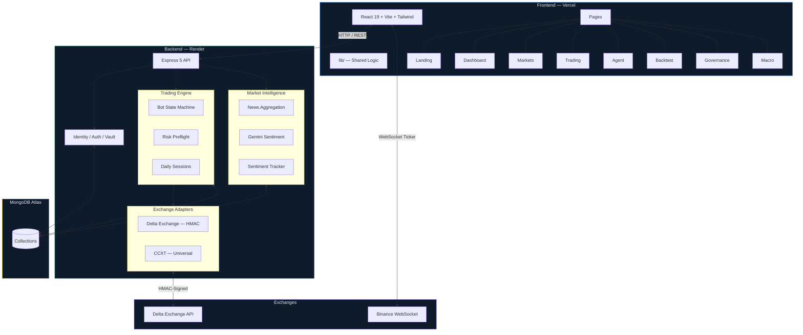
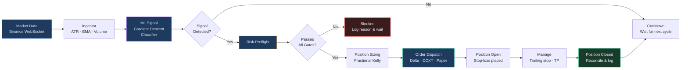
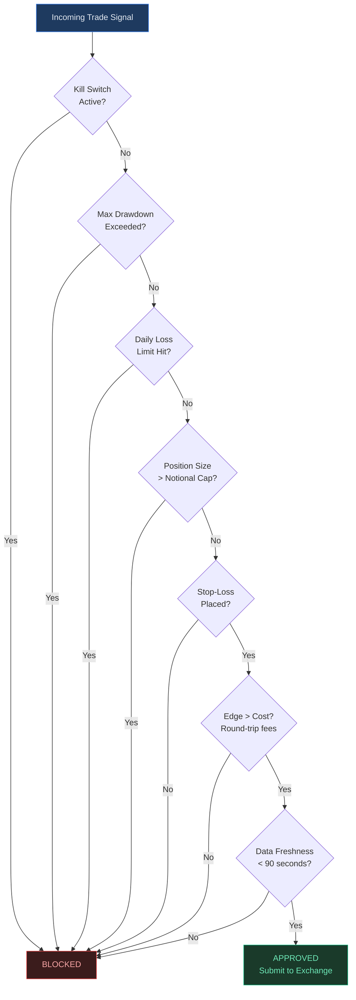

<p align="center">
  
  
  
  
  
  
</p>

# Venture DAO

**Autonomous quantitative trading platform** with real-time market intelligence, ML-driven signal generation, and DAO governance — built as a full-stack monorepo deployed across Vercel (frontend) and Render (backend).

> A trading tool that only shows its good simulations is a sales pitch, not a tool.

---

## Features

| Feature | Description |
|---------|-------------|
| **Autonomous Trading Bot** | Server-side execution engine with state machine lifecycle, fractional Kelly sizing, and idempotent order dispatch |
| **Deterministic Risk Gates** | Mandatory preflight checks — drawdown ceilings, daily loss limits, position caps, and stop-loss enforcement — that nothing can override |
| **Live Market Terminal** | Real-time candlestick charts with crosshair, wheel zoom, drag pan, fullscreen, and indicator overlays (EMA, ATR, Donchian, Bollinger) |
| **Walk-Forward ML Signals** | Logistic regression model trained with gradient descent on scale-free features, validated with zero lookahead bias |
| **AI Sentiment Analysis** | Gemini-powered news sentiment extraction with forward-performance tracking — votes with weight zero until accuracy is proven |
| **DAO Governance** | On-chain proposal system with token-weighted voting, treasury telemetry, and delegation mechanics |
| **Strategy Backtester** | Monte Carlo simulation engine with walk-forward validation across multiple timeframes and cost models |
| **Macro Dashboard** | Global market indicators, equity proxies via Yahoo Finance, and cross-asset correlation tracking |
| **Vault Security** | AES-256-GCM encryption for all credentials at rest, scrypt password hashing, and HMAC-signed exchange calls |
| **Light / Dark Theme** | Full theme system with institutional-grade UI polish in both modes |

---

## Architecture



---

## Trading Pipeline



---

## Risk Gate System



---

## Tech Stack

| Layer | Technology |
|-------|-----------|
| **Frontend** | React 19, Vite 8, TailwindCSS 3, Recharts, Lucide Icons, React Router 7 |
| **Backend** | Express 5, MongoDB 7 (native driver), CCXT, Axios |
| **Security** | AES-256-GCM vault, scrypt hashing, HMAC request signing, rate limiting, CORS |
| **AI / ML** | Custom gradient descent classifier, Google Gemini sentiment API |
| **Blockchain** | Ethers.js 6, DAO governance contracts |
| **Deployment** | Vercel (frontend), Render (backend), MongoDB Atlas (database) |
| **Testing** | Vitest |

---

## Getting Started

### Prerequisites

- **Node.js** ≥ 18
- **npm** ≥ 9
- MongoDB (local or Atlas URI)

### Installation

```bash
# Clone the repository
git clone https://github.com/divyanshubhatiwal/venture-dao.git
cd venture-dao

# Install all dependencies (root + workspaces)
npm install

# Copy environment template
cp .env.example .env
# Edit .env with your credentials
```

### Running Locally

Start these in order — the backend needs the database first:

```bash
# Terminal 1 — Database
npm run db

# Terminal 2 — Backend API (localhost:5000)
npm run server

# Terminal 3 — Frontend dev server (localhost:5173)
npm run dev
```

Then open [http://localhost:5173](http://localhost:5173).

### Available Scripts

| Command | Description |
|---------|-------------|
| `npm run dev` | Start frontend dev server |
| `npm run server` | Start backend server |
| `npm run server:dev` | Start backend with hot-reload |
| `npm run db` | Start local MongoDB instance |
| `npm test` | Run all tests |
| `npm run test:backend` | Run backend tests only |
| `npm run test:frontend` | Run frontend tests only |
| `npm run build` | Production build |
| `npm run preflight` | Verify exchange connectivity and config |
| `npm run db:migrate` | Import from legacy SQLite |

---

## Project Structure

```
venture-dao/
├── frontend/                    # React SPA (Vercel)
│   └── src/
│       ├── pages/               # Route-level screens
│       │   ├── Landing.jsx      # Public marketing page
│       │   ├── Dashboard.jsx    # Portfolio overview
│       │   ├── Markets.jsx      # Live market terminal & charts
│       │   ├── Trading.jsx      # Order execution interface
│       │   ├── Agent.jsx        # Autonomous bot controls
│       │   ├── Backtest.jsx     # Strategy backtester
│       │   ├── Governance.jsx   # DAO proposals & voting
│       │   └── Macro.jsx        # Global macro indicators
│       ├── components/          # Shared UI components
│       ├── context/             # React contexts (Auth, Market, Trading, Theme, etc.)
│       └── lib/                 # Business logic (no UI)
│           ├── api/             # Backend API clients
│           ├── market/          # Price feeds, candles, currency conversion
│           ├── trading/         # Indicators, signals, backtests, strategies
│           ├── agent/           # Decision pipeline & reasoning
│           └── demo/            # Guided tour & demo dataset
│
├── backend/                     # Express API (Render)
│   ├── routes/                  # Domain API routers
│   │   ├── authRoutes.js        # Register, login, logout, session
│   │   ├── botRoutes.js         # Bot controls & status
│   │   ├── venueRoutes.js       # Exchange order routing
│   │   ├── newsRoutes.js        # Headlines & sentiment
│   │   └── proxyRoutes.js       # Yahoo Finance equity proxy
│   ├── middleware/              # Auth guards, rate limiting, async helpers
│   ├── identity/                # Authentication & AES-256 vault
│   ├── storage/                 # MongoDB connection, queries, indexes
│   ├── trading/                 # Bot engine, daily sessions, exchange adapters
│   ├── market/                  # News, Gemini sentiment, performance tracking
│   └── __tests__/               # Backend test suite
│
└── research/                    # Model training & analysis artifacts
```

> **Design principle:** `lib/` in the frontend mirrors the backend's folders — `trading/` matches `trading/`, `agent/` matches `agent/`. A change usually lands in the same-named folder on both sides.

---

## Configuration

Copy `.env.example` → `.env` and fill in your values. The `.env` file is gitignored and must never be committed.

### Key Environment Variables

| Variable | Description |
|----------|-------------|
| `MONGODB_URI` | MongoDB connection string |
| `DELTA_API_KEY` / `DELTA_API_SECRET` | Delta Exchange credentials |
| `DELTA_VAULT_KEY` | AES-256-GCM key for encrypting secrets at rest |
| `GEMINI_API_KEY` | Google Gemini API key for sentiment analysis |
| `CORS_ORIGIN` | Allowed frontend origin |
| `DELTA_ENV` | `testnet` or `live` |
| `DELTA_ALLOW_LIVE` | Must be `true` alongside `DELTA_ENV=live` to enable real trading |

> **Security:** Nothing holding a secret may be prefixed `VITE_` — that prefix compiles values into the browser bundle.

> **Live trading** requires **both** `DELTA_ENV=live` and `DELTA_ALLOW_LIVE=true`. Either one alone falls back to testnet, so a single typo cannot start moving real money.

---

## Deployment

| Service | Platform | Purpose |
|---------|----------|---------|
| Database | MongoDB Atlas | Managed database with IP allowlisting |
| Backend | Render | Long-running process with static outbound IP |
| Frontend | Vercel | Static bundle with edge CDN |

> **Key constraint:** Delta Exchange whitelists API keys by IP. The backend needs a fixed outbound address — this rules out most free tiers.

See [`DEPLOY.md`](DEPLOY.md) for the full deployment guide.

---

## Testing

```bash
# Run all tests
npm test

# Backend only
npm run test:backend

# Frontend only
npm run test:frontend

# Exchange connectivity check (read-only, places nothing)
npm run preflight
```

---

## Honest Performance Disclosure

This project measures and reports its own performance honestly:

- **Profit factor 0.94** — below 1.0 loses money, and it stayed below with fees zeroed
- **31 winning trades out of 31**, account still down **6.16%** — fees were 4× gross profit
- **0 of 2,000 simulated runs** reached the goal; every one hit the loss limit
- The trained model has **negative out-of-sample lift** on every market tested
- News sentiment has **not yet been proven** and votes with weight zero

These numbers are displayed on the landing page. A trading tool that hides its losses is a sales pitch, not a tool.

---

## License

This project is private and proprietary.

---

<p align="center">
  Built by <a href="https://github.com/divyanshubhatiwal">Divyanshu Bhatiwal</a>
</p>
